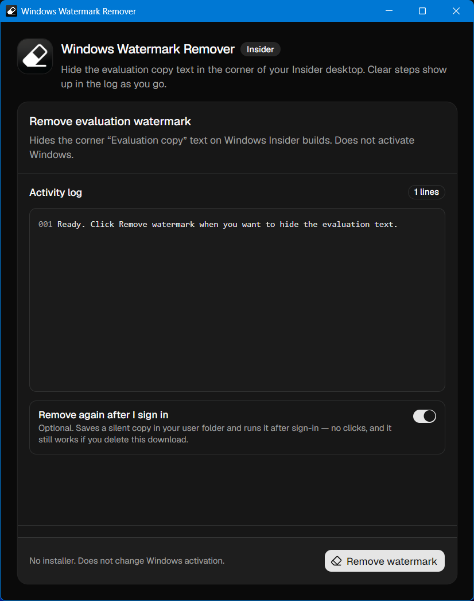

# Windows Watermark Remover

Portable Windows app that hides the Insider **Evaluation copy** watermark in the desktop corner. No installer. Does not change Windows activation.



## Download

Get the latest build from [Releases](https://github.com/artechio/windows-watermark-remover/releases/latest).

1. Download **Windows-Watermark-Remover.exe**
2. Run it
3. Click **Remove watermark**
4. Optionally turn on **Remove again after I sign in**

When that option is on, the app keeps a silent copy as **Windows Watermark Remover.exe** under your Local AppData folder and registers that fixed path for sign-in — so deleting the download on your Desktop does not break it.

After a reboot, keep that option on and use the latest release — the silent copy re-applies quietly at sign-in for a couple of minutes so the watermark stays gone if Windows refreshes the desktop.

CI builds are also available from [Actions](https://github.com/artechio/wwr/actions).

## What it does

- Removes the Insider evaluation / build string from the desktop corner
- Shows a simple window with a live activity log
- Leaves system files under `C:\Windows` alone
- Does **not** remove the separate “Activate Windows” notice

The watermark comes back after Explorer or Windows restarts unless you enable the optional sign-in setting.

## Develop

```sh
npm install
npm run build
npm run build:app
```

Requires Windows for the full desktop build. Frontend is Vite + React + shadcn/ui. Backend is Rust / Tauri 2.

## Credits

Inspired by the desktop memory-patch approach explored in [UWD2](https://github.com/machineonamission/uwd2). This project is a separate implementation.

## License

MIT. See [LICENSE](LICENSE).
